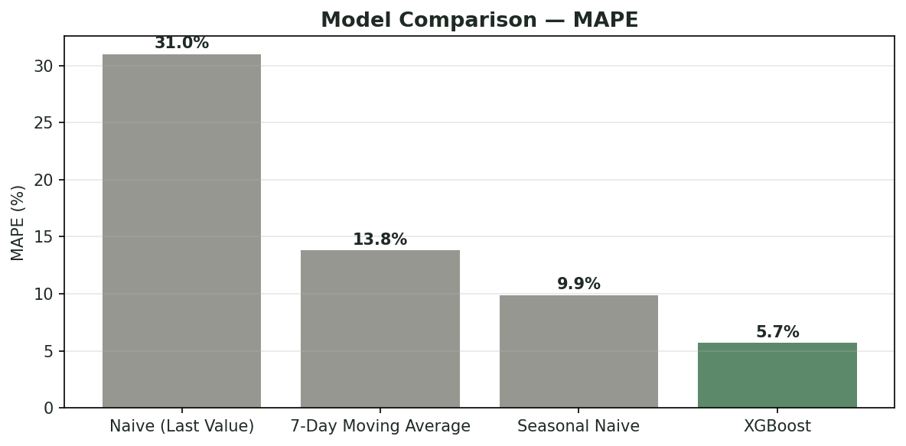
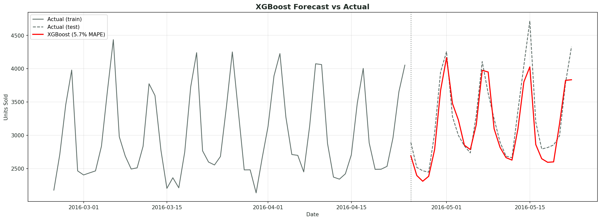
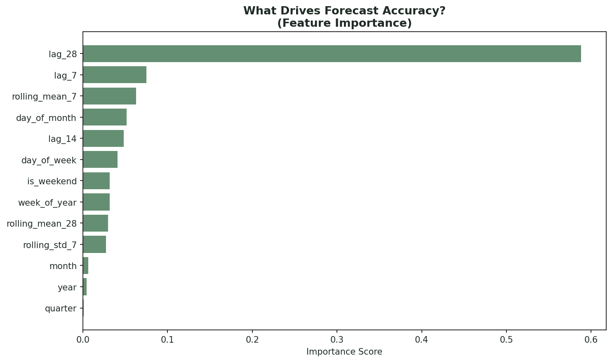

# Demand Forecasting Platform: M5 Walmart Dataset

End-to-end demand forecasting pipeline built on real Walmart sales data, combining classical baselines, tuned gradient boosting, and an AI-powered insight layer using the Claude API.

**Scope:** CA_1 store, FOODS category (category-level daily demand, not yet SKU-level; see *Limitations* below)

## Results

The model's forecast lands within about 6% of actual sales, five times closer than simply assuming tomorrow will look like today.

| Model | MAPE | Notes |
|---|---|---|
| Naive (Last Value) | ~31% | Repeats the last known day forever |
| 7-Day Moving Average | ~13.8% | Smooths recent history |
| Seasonal Naive (same weekday, prior week) | 9.9% | Standard baseline |
| **Gradient Boosting (tuned)** | **5.7%** | 42% improvement over baseline |

The tuned model was found via grid search across `n_estimators`, `max_depth`, and `learning_rate` (27 combinations tested), not left at default hyperparameters. The winning configuration (`n_estimators=100, max_depth=7, learning_rate=0.05`) uses fewer, deeper trees than the untuned starting point, and outperformed it by about 1.4 percentage points of MAPE.

## Key Finding

`lag_28` (same weekday, 4 weeks prior) is by far the strongest predictor, more important than every other feature combined (importance score 0.588 vs. 0.412 for all 12 remaining features together). This points to a strong ~4-week demand cycle in this data, stronger than the 1-week or 2-week lag alternatives. Calendar features like `day_of_week` don't rank highly on their own, likely because `lag_28` already encodes that same weekly-pattern information more directly.

## Evaluation Methodology Correction

An earlier version of this evaluation computed lag and rolling features on the full dataset before splitting into train/test, allowing later days in the 28-day test window to use real values from earlier in that same window for `lag_7` and `lag_14`. `lag_28`, the model's single most important feature, was unaffected, since the 28-day forecast horizon exactly matches its lag window.

Re-evaluating with a recursive forecasting approach, predicting one day at a time and feeding each prediction forward, rather than using real future values, gives:

| Approach | MAPE |
|---|---|
| Original (single-shot, leaked) | 5.7% |
| Manual recursive implementation | 5.5% |
| mlforecast (Nixtla) recursive implementation | 6.0% |

All three results sit within a similar range, confirming the original evaluation was not meaningfully inflated by the leakage identified. The mlforecast comparison initially showed a larger gap (6.9%), traced to a feature mismatch (missing `is_weekend` and `week_of_year`, which mlforecast doesn't generate by default and required custom callables to match); after aligning feature sets, results converged to a comparable range, with the small remaining difference (~0.5 points) attributable to implementation-level differences between the two approaches.

Thanks to Jan Rathfelder for catching this during a LinkedIn discussion, prompting this corrected evaluation.

## Notebooks

| Notebook | What it does |
|---|---|
| `01_exploration.ipynb` | EDA, melting wide to long format, joining to calendar, weekly/SNAP/holiday pattern analysis |
| `02_baseline_models.ipynb` | Naive, 7-day moving average, and seasonal naive baselines |
| `03_xgboost_model.ipynb` | Feature engineering (calendar, lag, rolling-window features), gradient boosting model, hyperparameter grid search, feature importance |
| `04_ai_insights.ipynb` | Claude API integration for anomaly explanation, executive summary generation, and open-ended Q&A grounded in computed statistics |
| `05_recursive_forecast.ipynb` | Corrected recursive (leakage-safe) evaluation, comparison against mlforecast |

## Feature Engineering

- **Calendar:** day of week, day of month, month, year, week of year, quarter, weekend flag
- **Lag features:** sales from 7, 14, and 28 days prior
- **Rolling windows:** 7- and 28-day rolling mean, 7-day rolling standard deviation (all computed on prior days only, via `.shift(1)`, to avoid leaking same-day information into training)

## AI Insight Layer

Rather than having an LLM analyze raw data directly, this project follows a compute-then-narrate pattern: all statistics are calculated deterministically in pandas first, and the Claude API is used only to turn those verified numbers into readable, stakeholder-facing language. Claude never has direct access to the dataset; it only ever sees the specific numbers explicitly passed into each prompt. Three capabilities:

- **Anomaly explanation.** Python identifies the day with the largest forecast deviation using pandas (`idxmax()` on percent deviation), then that day's specific actual, forecast, and date values are passed to Claude, which generates a plausible business explanation and an inventory recommendation from those numbers alone.
- **Executive summary generation.** Produces a VP-ready summary from real model performance and demand statistics (MAPE, averages, weekend vs. weekday split).
- **Open-ended Q&A.** Answers business questions (for example, "should we increase safety stock for weekends?") grounded in a fixed context string of pre-computed statistics.

This mirrors how AI-generated insights are implemented in production BI tools (for example, Power BI Copilot, Tableau Pulse): LLMs are used for language generation over trusted, pre-computed numbers, not as the analytical engine itself.

## Tech Stack

`Python` · `Pandas` · `NumPy` · `Scikit-learn (Gradient Boosting)` · `Claude API` · `Matplotlib`

## Limitations

- **Category-level, not SKU-level.** This model forecasts total daily FOODS demand for one store, not individual item demand. Real demand planning typically requires SKU-location-level forecasts for replenishment decisions. Extending this pipeline to the item level (using `subset_long_CA1_FOODS.csv`, which retains `item_id`) is a natural next step.
- **Single train/test split.** Evaluation uses one 28-day holdout window. A more robust evaluation would use walk-forward validation across multiple rolling windows to confirm the MAPE is representative, not a lucky or unlucky snapshot.
- **MAPE excludes zero-sales days by construction** (division by zero), which can hide poor performance on low-volume or stockout days. MAE is reported alongside MAPE for this reason.
- **Single store, single category.** Not yet validated across other stores or product categories.

## What This Demonstrates

This project was built to develop and demonstrate forecasting skills directly relevant to demand planning roles: understanding why a model works, not just running library defaults; rigorous baseline comparison; hyperparameter tuning with evidence; and translating technical output into business-usable language.

*Built by Solongo Boldtseren*
